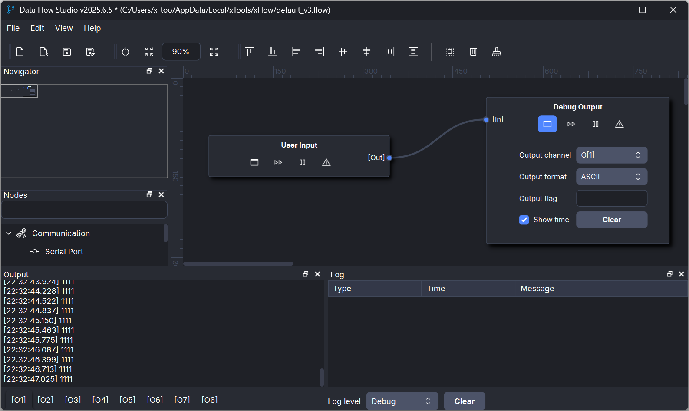
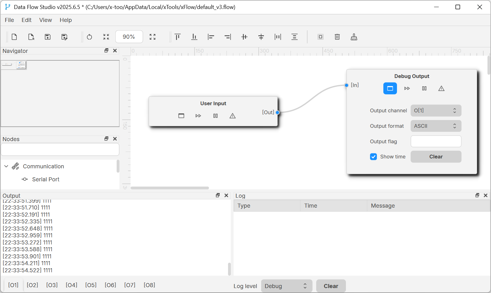

# xFLow     

xFlow(Data Flow Studio) is a configurable and extensible communication data transfer tool, currently supports serial port, UDP, TCP, Web Socket data transfer.

> **You can get *xFlow* form [Micorsoft Store(sponsor)](https://apps.microsoft.com/detail/9pjk7d83p014)** or from [Github Release(community)](https://github.com/x-tools-author/x-flow/releases).

|Option|Description|
|---|---|
|Author|x-tools-author|
|E-mail|<x-tools@outlook.com>|
|User Communication| 952218522 (QQ Group)|
|Qt Technology Communication|723516989 (QQ Group)|
|Gitee| <https://gitee.com/x-tools-author/x-tools>|
|GitHub| <https://github.com/x-tools-author/x-tools>|
|Sponsor|<https://apps.microsoft.com/search/publisher?name=x-tools-author>|
|Third party|[glog](https://github.com/google/glog) [nodeeditor](https://github.com/paceholder/nodeeditor) [qlementine](https://github.com/oclero/qlementine) [lua](https://github.com/lua/lua) [Qt-AES](https://github.com/bricke/Qt-AES)|

## Dark theme

## Light theme

